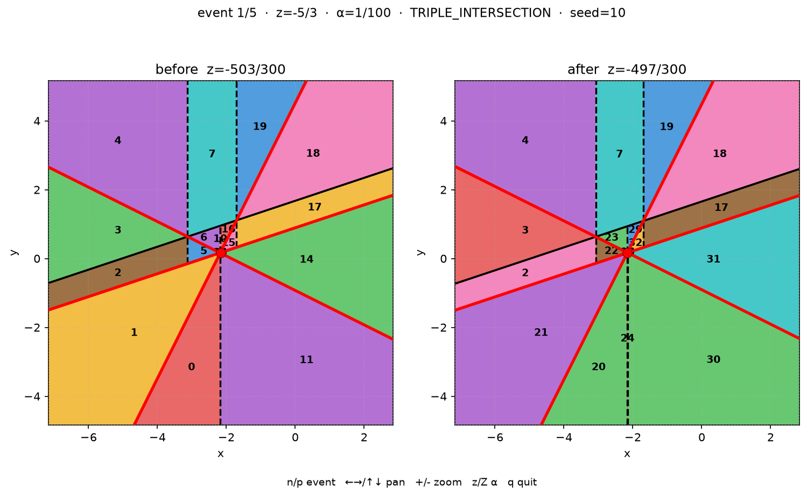

# Vertical decomposition of planes in 3D

Sweep-based vertical decomposition of an arrangement of planes, following
[design.md](design.md). Exact `Fraction` arithmetic throughout.

## Status

Implemented end to end: events, incremental 2D updates, 3D cell lifecycle,
and point location. For debugging, `--show-sweep` steps through each event
and shows how the sweep-plane vertical decomposition evolves before and after.

## Install

```bash
python3 -m venv .venv
source .venv/bin/activate
python -m pip install -e ".[dev]"
```

Requires Python 3.11+. The virtual environment is gitignored.

## Compute a vertical decomposition

```bash
# from a plane file (each line: a b c d, or id a b c d; # comments ok)
python -m vd3d examples/three_planes.txt

# debug: N random general-position planes, optional seed
python -m vd3d --random-planes 5 --seed 42

# write the sampled planes for reuse
python -m vd3d --random-planes 5 --seed 42 --write-planes /tmp/planes.txt

# interactive 3D view (n/p cells, +/- zoom, arrows rotate, q quit)
python -m vd3d examples/three_planes.txt --gui
python -m vd3d --random-planes 4 --seed 42 --gui

# sweep-plane before/after each event (n/p events, pan/zoom, z/Z α)
python -m vd3d examples/three_planes.txt --show-sweep
python -m vd3d --random-planes 4 --seed 42 --show-sweep
```

Coefficients are exact (`int` or Fraction strings like `3/2`). The plane
equation is `a*x + b*y + c*z + d = 0`. Output lists every 3D cell with its
floor, ceiling, vertical walls, and z-extent. With `--gui`, input planes are
transparent grey, intersection lines dark grey, and the selected cell's walls
semi-transparent red (unbounded faces clipped to a viewing cube). With
`--show-sweep`, each event shows the 2D VD at `z±α` side by side: solid
arrangement lines, dashed vertical walls, adjacency-coloured cells with ids,
and a red event marker.

### Example: `--random-planes 4 --seed 10 --show-sweep`

```bash
python -m vd3d --random-planes 4 --seed 10 --show-sweep
```



```text
warning: 2 events share z=-1/2 (TRIPLE_INTERSECTION, TRIPLE_INTERSECTION); planes are not in general position
planes: 4
events: 6
intervals: 6
cells: 70
seed: 10

input planes:
  P1: -4x+2y+3z-4=0
  P2: -x+3y+3z=0
  P3: -2x-4y+4z+3=0
  P4: x-3y-z+1=0

3D cells:
  cell 0: floor=unbounded ceiling=P1:-4x+2y+3z-4=0 walls=[P-1:x-z+1/2=0] z=(-∞, -5/3)
  cell 1: floor=P1:-4x+2y+3z-4=0 ceiling=P4:x-3y-z+1=0 walls=[P-1:x-8/5z-1/2=0] z=(-∞, -5/3)
  cell 2: floor=P4:x-3y-z+1=0 ceiling=P2:-x+3y+3z=0 walls=[P-1:x-12/5z-9/10=0] z=(-∞, -19/17)
  cell 3: floor=P2:-x+3y+3z=0 ceiling=P3:-2x-4y+4z+3=0 walls=[none] z=(-∞, -1)
  cell 4: floor=P3:-2x-4y+4z+3=0 ceiling=unbounded walls=[P-1:x-12/5z-9/10=0] z=(-∞, -1)
  cell 5: floor=P4:x-3y-z+1=0 ceiling=P3:-2x-4y+4z+3=0 walls=[P-1:x-12/5z-9/10=0] z=(-∞, -5/3)
  cell 6: floor=P3:-2x-4y+4z+3=0 ceiling=P2:-x+3y+3z=0 walls=[P-1:x-8/5z-1/2=0] z=(-∞, -5/3)
  cell 7: floor=P2:-x+3y+3z=0 ceiling=unbounded walls=[P-1:x-12/5z-9/10=0, P-1:x-3/10z+6/5=0] z=(-∞, -1)
  cell 8: floor=P1:-4x+2y+3z-4=0 ceiling=P3:-2x-4y+4z+3=0 walls=[P-1:x-8/5z-1/2=0] z=(-∞, -5/3)
  cell 9: floor=P3:-2x-4y+4z+3=0 ceiling=P4:x-3y-z+1=0 walls=[P-1:x-z+1/2=0] z=(-∞, -5/3)
  cell 10: floor=P4:x-3y-z+1=0 ceiling=P2:-x+3y+3z=0 walls=[P-1:x-8/5z-1/2=0, P-1:x-7/10z+1=0] z=(-∞, -5/3)
  cell 11: floor=unbounded ceiling=P3:-2x-4y+4z+3=0 walls=[P-1:x-z+1/2=0] z=(-∞, -5/3)
  cell 12: floor=P3:-2x-4y+4z+3=0 ceiling=P1:-4x+2y+3z-4=0 walls=[P-1:x-7/10z+1=0] z=(-∞, -5/3)
  cell 13: floor=P1:-4x+2y+3z-4=0 ceiling=P4:x-3y-z+1=0 walls=[P-1:x-z+1/2=0] z=(-∞, -5/3)
  cell 14: floor=P3:-2x-4y+4z+3=0 ceiling=P4:x-3y-z+1=0 walls=[P-1:x-7/10z+1=0] z=(-∞, -5/3)
  cell 15: floor=P4:x-3y-z+1=0 ceiling=P1:-4x+2y+3z-4=0 walls=[P-1:x-3/10z+6/5=0] z=(-∞, -5/3)
  cell 16: floor=P1:-4x+2y+3z-4=0 ceiling=P2:-x+3y+3z=0 walls=[P-1:x-7/10z+1=0] z=(-∞, -5/3)
  cell 17: floor=P4:x-3y-z+1=0 ceiling=P2:-x+3y+3z=0 walls=[P-1:x-3/10z+6/5=0] z=(-∞, -17/13)
  cell 18: floor=P2:-x+3y+3z=0 ceiling=P1:-4x+2y+3z-4=0 walls=[none] z=(-∞, -1)
  cell 19: floor=P1:-4x+2y+3z-4=0 ceiling=unbounded walls=[P-1:x-3/10z+6/5=0] z=(-∞, -1)
  cell 20: floor=unbounded ceiling=P1:-4x+2y+3z-4=0 walls=[P-1:x-7/10z+1=0] z=(-5/3, -1/2)
  cell 21: floor=P1:-4x+2y+3z-4=0 ceiling=P4:x-3y-z+1=0 walls=[none] z=(-5/3, -1/2)
  cell 22: floor=P4:x-3y-z+1=0 ceiling=P3:-2x-4y+4z+3=0 walls=[P-1:x-12/5z-9/10=0, P-1:x-7/10z+1=0] z=(-5/3, -19/17)
  cell 23: floor=P3:-2x-4y+4z+3=0 ceiling=P2:-x+3y+3z=0 walls=[P-1:x-z+1/2=0] z=(-5/3, -1)
  cell 24: floor=unbounded ceiling=P4:x-3y-z+1=0 walls=[P-1:x-7/10z+1=0, P-1:x-8/5z-1/2=0] z=(-5/3, -1/2)
  cell 25: floor=P4:x-3y-z+1=0 ceiling=P1:-4x+2y+3z-4=0 walls=[P-1:x-z+1/2=0] z=(-5/3, -1)
  cell 26: floor=P1:-4x+2y+3z-4=0 ceiling=P3:-2x-4y+4z+3=0 walls=[P-1:x-7/10z+1=0] z=(-5/3, -19/17)
  cell 27: floor=P4:x-3y-z+1=0 ceiling=P3:-2x-4y+4z+3=0 walls=[P-1:x-z+1/2=0] z=(-5/3, -1)
  cell 28: floor=P3:-2x-4y+4z+3=0 ceiling=P1:-4x+2y+3z-4=0 walls=[P-1:x-8/5z-1/2=0] z=(-5/3, -17/13)
  cell 29: floor=P1:-4x+2y+3z-4=0 ceiling=P2:-x+3y+3z=0 walls=[P-1:x-z+1/2=0] z=(-5/3, -1)
  cell 30: floor=unbounded ceiling=P3:-2x-4y+4z+3=0 walls=[P-1:x-8/5z-1/2=0] z=(-5/3, -1/2)
  cell 31: floor=P3:-2x-4y+4z+3=0 ceiling=P4:x-3y-z+1=0 walls=[none] z=(-5/3, -1/2)
  cell 32: floor=P4:x-3y-z+1=0 ceiling=P1:-4x+2y+3z-4=0 walls=[P-1:x-8/5z-1/2=0, P-1:x-3/10z+6/5=0] z=(-5/3, -17/13)
  cell 33: floor=P3:-2x-4y+4z+3=0 ceiling=P1:-4x+2y+3z-4=0 walls=[P-1:x-3/10z+6/5=0] z=(-17/13, -1)
  cell 34: floor=P3:-2x-4y+4z+3=0 ceiling=P2:-x+3y+3z=0 walls=[P-1:x-3/10z+6/5=0, P-1:x-8/5z-1/2=0] z=(-17/13, -1)
  cell 35: floor=P4:x-3y-z+1=0 ceiling=P2:-x+3y+3z=0 walls=[P-1:x-8/5z-1/2=0] z=(-17/13, -1/2)
  cell 36: floor=P4:x-3y-z+1=0 ceiling=P2:-x+3y+3z=0 walls=[P-1:x-7/10z+1=0] z=(-19/17, -1/2)
  cell 37: floor=P1:-4x+2y+3z-4=0 ceiling=P2:-x+3y+3z=0 walls=[P-1:x-7/10z+1=0, P-1:x-12/5z-9/10=0] z=(-19/17, -1)
  cell 38: floor=P1:-4x+2y+3z-4=0 ceiling=P3:-2x-4y+4z+3=0 walls=[P-1:x-12/5z-9/10=0] z=(-19/17, -1)
  cell 39: floor=P2:-x+3y+3z=0 ceiling=P3:-2x-4y+4z+3=0 walls=[P-1:x-3/10z+6/5=0] z=(-1, -1/2)
  cell 40: floor=P3:-2x-4y+4z+3=0 ceiling=unbounded walls=[P-1:x-z+1/2=0] z=(-1, +∞)
  cell 41: floor=P4:x-3y-z+1=0 ceiling=P1:-4x+2y+3z-4=0 walls=[P-1:x-3/10z+6/5=0] z=(-1, -1/2)
  cell 42: floor=P1:-4x+2y+3z-4=0 ceiling=P2:-x+3y+3z=0 walls=[P-1:x-7/10z+1=0] z=(-1, -1/2)
  cell 43: floor=P4:x-3y-z+1=0 ceiling=P2:-x+3y+3z=0 walls=[P-1:x-3/10z+6/5=0, P-1:x-12/5z-9/10=0] z=(-1, -1/2)
  cell 44: floor=P2:-x+3y+3z=0 ceiling=P1:-4x+2y+3z-4=0 walls=[P-1:x-z+1/2=0] z=(-1, -1/2)
  cell 45: floor=P1:-4x+2y+3z-4=0 ceiling=P3:-2x-4y+4z+3=0 walls=[P-1:x-3/10z+6/5=0] z=(-1, -1/2)
  cell 46: floor=P2:-x+3y+3z=0 ceiling=P3:-2x-4y+4z+3=0 walls=[P-1:x-z+1/2=0] z=(-1, -1/2)
  cell 47: floor=P3:-2x-4y+4z+3=0 ceiling=P1:-4x+2y+3z-4=0 walls=[P-1:x-12/5z-9/10=0] z=(-1, -1/2)
  cell 48: floor=P1:-4x+2y+3z-4=0 ceiling=unbounded walls=[P-1:x-z+1/2=0] z=(-1, +∞)
  cell 49: floor=P4:x-3y-z+1=0 ceiling=P3:-2x-4y+4z+3=0 walls=[P-1:x-12/5z-9/10=0] z=(-1, -1/2)
  cell 50: floor=P3:-2x-4y+4z+3=0 ceiling=P2:-x+3y+3z=0 walls=[P-1:x-8/5z-1/2=0] z=(-1, -1/2)
  cell 51: floor=P2:-x+3y+3z=0 ceiling=P1:-4x+2y+3z-4=0 walls=[P-1:x-12/5z-9/10=0] z=(-1, -1/2)
  cell 52: floor=unbounded ceiling=P1:-4x+2y+3z-4=0 walls=[P-1:x-3/10z+6/5=0] z=(-1/2, +∞)
  cell 53: floor=P1:-4x+2y+3z-4=0 ceiling=P2:-x+3y+3z=0 walls=[none] z=(-1/2, +∞)
  cell 54: floor=P2:-x+3y+3z=0 ceiling=P4:x-3y-z+1=0 walls=[P-1:x-3/10z+6/5=0] z=(-1/2, +∞)
  cell 55: floor=P4:x-3y-z+1=0 ceiling=P3:-2x-4y+4z+3=0 walls=[P-1:x-7/10z+1=0] z=(-1/2, +∞)
  cell 56: floor=unbounded ceiling=P2:-x+3y+3z=0 walls=[P-1:x-3/10z+6/5=0, P-1:x-12/5z-9/10=0] z=(-1/2, +∞)
  cell 57: floor=P2:-x+3y+3z=0 ceiling=P1:-4x+2y+3z-4=0 walls=[P-1:x-7/10z+1=0] z=(-1/2, +∞)
  cell 58: floor=P1:-4x+2y+3z-4=0 ceiling=P4:x-3y-z+1=0 walls=[P-1:x-3/10z+6/5=0] z=(-1/2, +∞)
  cell 59: floor=P4:x-3y-z+1=0 ceiling=P1:-4x+2y+3z-4=0 walls=[P-1:x-z+1/2=0] z=(-1/2, +∞)
  cell 60: floor=P2:-x+3y+3z=0 ceiling=P4:x-3y-z+1=0 walls=[P-1:x-7/10z+1=0, P-1:x-8/5z-1/2=0] z=(-1/2, +∞)
  cell 61: floor=P1:-4x+2y+3z-4=0 ceiling=P3:-2x-4y+4z+3=0 walls=[P-1:x-7/10z+1=0] z=(-1/2, +∞)
  cell 62: floor=P4:x-3y-z+1=0 ceiling=P3:-2x-4y+4z+3=0 walls=[P-1:x-z+1/2=0] z=(-1/2, +∞)
  cell 63: floor=P3:-2x-4y+4z+3=0 ceiling=P1:-4x+2y+3z-4=0 walls=[P-1:x-8/5z-1/2=0] z=(-1/2, +∞)
  cell 64: floor=P2:-x+3y+3z=0 ceiling=P3:-2x-4y+4z+3=0 walls=[P-1:x-8/5z-1/2=0] z=(-1/2, +∞)
  cell 65: floor=P3:-2x-4y+4z+3=0 ceiling=P4:x-3y-z+1=0 walls=[P-1:x-12/5z-9/10=0] z=(-1/2, +∞)
  cell 66: floor=P4:x-3y-z+1=0 ceiling=P1:-4x+2y+3z-4=0 walls=[P-1:x-8/5z-1/2=0] z=(-1/2, +∞)
  cell 67: floor=unbounded ceiling=P3:-2x-4y+4z+3=0 walls=[P-1:x-12/5z-9/10=0] z=(-1/2, +∞)
  cell 68: floor=P3:-2x-4y+4z+3=0 ceiling=P2:-x+3y+3z=0 walls=[none] z=(-1/2, +∞)
  cell 69: floor=P2:-x+3y+3z=0 ceiling=P4:x-3y-z+1=0 walls=[P-1:x-12/5z-9/10=0] z=(-1/2, +∞)
```

## Conventions and invariants

- [docs/conventions.md](docs/conventions.md) — axes, "vertical", exact arithmetic, general position
- [docs/geometry.md](docs/geometry.md) — plane equation, orientation, intersections, slices
- [docs/arrangement2d.md](docs/arrangement2d.md) — DCEL, CCW order, Euler characteristic
- [docs/vertical_decomposition.md](docs/vertical_decomposition.md) — y-parallel walls, trapezoid cells
- [docs/zone.md](docs/zone.md) — query-line zone, supporting-line opposite vertices
- [docs/events.md](docs/events.md) — intersection lines, triple events, sort key
- [docs/alignment.md](docs/alignment.md) — y-parallel walls, alignment oracle vs zone
- [docs/event_list.md](docs/event_list.md) — combined events, initial z, VD at a slice
- [docs/sweep.md](docs/sweep.md) — reference sweep, 3D cells, matching, oracles
- [docs/incremental.md](docs/incremental.md) — local 2D updates vs recompute oracle
- [docs/robustness.md](docs/robustness.md) — simultaneous groups, zone degeneracies
- [docs/invariants.md](docs/invariants.md) — checklist from the design; boxes are checked only when code enforces them

## Layout

```text
vd3d/                 library (kernel packages must not import viz)
docs/                 human-readable notes, one concern per file
tests/unit/           exact, non-graphical tests
tests/visual/         write PNG + caption under artifacts/visual/
tests/oracles/        slow brute-force checkers
artifacts/visual/     generated review gallery (gitignored)
```

## License

This software is provided as-is, without warranty of any kind. I would like
it to be bug-free, but I cannot guarantee that. There is no support beyond
what I can do in my free time.

If you use this project in your research, please cite it.

## Author

Hayim Shaul.
